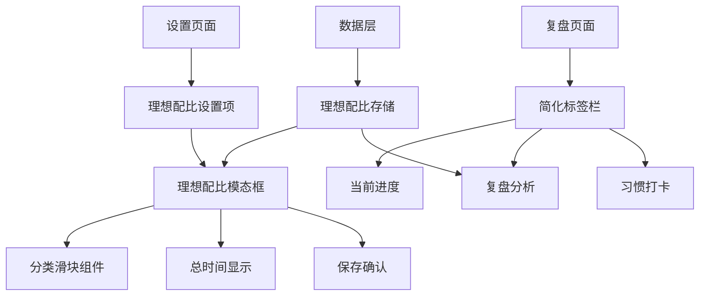
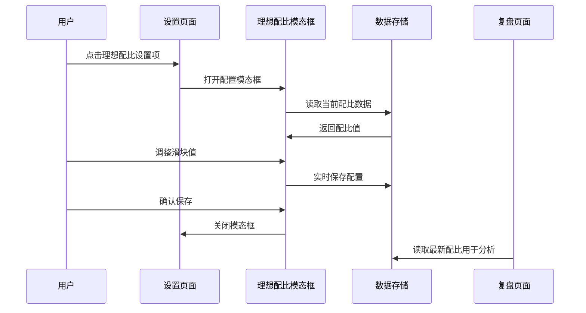

# 理想配比入口迁移设计文档

## 概述

本设计文档描述了将"理想配比"功能从复盘页面迁移到设置页面的技术实现方案。该迁移旨在改善功能组织结构，将配置类功能统一管理，提升用户体验。

## 架构设计

### 组件架构图



### 数据流设计



## 组件设计

### 1. 理想配比设置项组件

**职责**: 在设置页面中显示理想配比入口

```typescript
interface IdealRatioSettingItemProps {
  onClick: () => void;
  currentAllocations: AllocationConfig;
}
```

**功能特性**:
- 显示目标图标和渐变背景
- 展示当前配置的总时间状态
- 提供悬停效果和点击反馈
- 与其他设置项保持一致的视觉风格

### 2. 理想配比配置模态框

**职责**: 提供完整的理想配比配置界面

```typescript
interface IdealRatioModalProps {
  isOpen: boolean;
  onClose: () => void;
  allocations: AllocationConfig;
  onSave: (allocations: AllocationConfig) => void;
}
```

**功能特性**:
- 包含8个分类的滑块控件
- 实时计算和显示总时间
- 提供保存和取消操作
- 支持键盘导航和无障碍访问

### 3. 分类滑块组件（复用现有）

**职责**: 单个分类的时间配置控件

```typescript
interface AllocationSliderProps {
  label: string;
  value: number;
  icon: React.ComponentType;
  colorBg: string;
  onChange: (value: number) => void;
  max?: number;
}
```

## 数据模型

### 理想配比配置

```typescript
interface AllocationConfig {
  work: number;        // 工作时间（小时）
  study: number;       // 学习时间（小时）
  rest: number;        // 休息时间（小时）
  sleep: number;       // 睡眠时间（小时）
  life: number;        // 生活时间（小时）
  entertainment: number; // 娱乐时间（小时）
  health: number;      // 健康时间（小时）
  hobby: number;       // 兴趣时间（小时）
}
```

### 存储格式

```typescript
// localStorage key: 'idealRatioAllocations'
const storageFormat = {
  version: '1.0',
  lastUpdated: string,
  allocations: AllocationConfig
};
```

## 正确性属性

*属性是一个特征或行为，应该在系统的所有有效执行中保持真实——本质上，是关于系统应该做什么的正式陈述。属性作为人类可读规范和机器可验证正确性保证之间的桥梁。*

### 属性 1: 配置数据一致性
*对于任何*理想配比配置更新，设置页面和复盘页面应该使用相同的配比数据进行计算和显示
**验证: 需求 5.4**

### 属性 2: 总时间约束验证
*对于任何*分类时间调整，所有分类时间的总和应该提供适当的验证反馈，当超过24小时时显示警告
**验证: 需求 2.3**

### 属性 3: 数据持久化完整性
*对于任何*理想配比设置的保存操作，数据应该正确存储到localStorage并在页面刷新后保持一致
**验证: 需求 5.1, 5.3**

### 属性 4: 界面状态同步
*对于任何*理想配比的修改，复盘页面中的对比分析应该立即反映新的配比设置
**验证: 需求 3.2, 3.5**

### 属性 5: 组件交互完整性
*对于任何*滑块控件的操作，应该实时更新对应的数值显示和总时间计算
**验证: 需求 2.2**

## 错误处理

### 数据加载错误
- 当localStorage数据损坏时，使用默认配比值
- 提供数据重置功能
- 显示友好的错误提示

### 保存失败处理
- 检测localStorage可用性
- 提供重试机制
- 显示保存状态反馈

### 数值验证错误
- 限制滑块输入范围（0-24小时）
- 处理非法数值输入
- 提供实时验证反馈

## 测试策略

### 单元测试
- 理想配比设置项组件渲染测试
- 配置模态框交互测试
- 数据存储和读取功能测试
- 滑块组件数值计算测试

### 集成测试
- 设置页面到模态框的完整流程测试
- 配置更新后复盘页面的数据同步测试
- 页面间导航和状态保持测试

### 用户体验测试
- 功能迁移后的用户操作流程测试
- 视觉设计一致性验证
- 响应式布局适配测试
- 无障碍访问功能测试

## 迁移策略

### 阶段1: 设置页面集成
1. 在设置页面添加理想配比设置项
2. 创建理想配比配置模态框
3. 实现数据读取和保存功能

### 阶段2: 复盘页面简化
1. 移除复盘页面的理想配比标签
2. 调整标签栏布局和样式
3. 确保复盘分析继续使用配比数据

### 阶段3: 测试和优化
1. 进行全面的功能测试
2. 优化用户体验和性能
3. 处理边缘情况和错误场景

## 性能考虑

### 数据缓存
- 在内存中缓存理想配比数据
- 避免频繁的localStorage读取
- 实现数据变更监听机制

### 组件优化
- 使用React.memo优化滑块组件渲染
- 实现防抖处理避免频繁保存
- 优化模态框的打开和关闭动画

### 存储优化
- 压缩存储数据格式
- 实现数据版本管理
- 提供数据迁移兼容性

## 无障碍访问

### 键盘导航
- 支持Tab键在滑块间切换
- 支持方向键调整滑块数值
- 提供键盘快捷键关闭模态框

### 屏幕阅读器
- 为滑块提供适当的aria-label
- 实现数值变化的语音反馈
- 提供模态框的焦点管理

### 视觉辅助
- 确保足够的颜色对比度
- 提供大字体模式支持
- 实现高对比度主题兼容