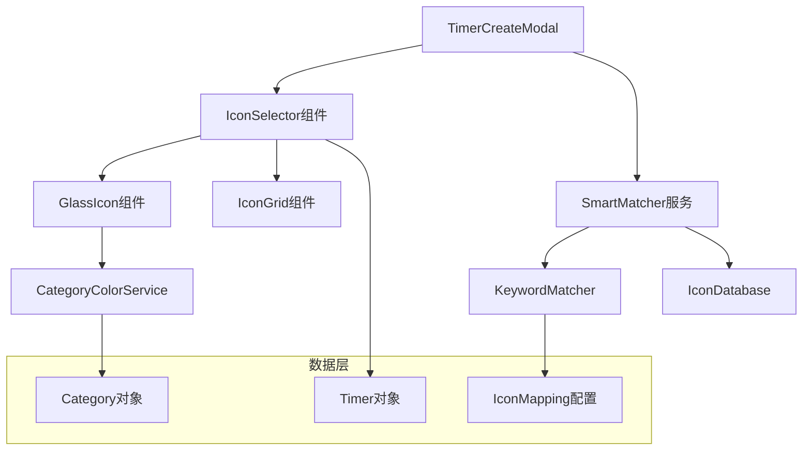

# 计时器图标选择功能设计文档

## 概述

本设计文档描述了为计时器应用添加图标选择功能的技术实现方案。该功能采用"Emoji + 拟态玻璃外壳"的现代化视觉设计，结合智能关键词匹配，为用户提供个性化和智能化的图标选择体验。

## 架构

### 系统架构图



### 组件层次结构

```
TimerCreateModal
├── IconSelector (新增)
│   ├── GlassIcon (新增)
│   └── IconGrid (新增)
├── SmartMatcher (新增服务)
│   ├── KeywordMatcher
│   └── IconDatabase
└── CategoryColorService (扩展)
```

## 组件和接口

### 1. IconSelector 组件

**职责**: 管理图标选择的主要逻辑和UI

```typescript
interface IconSelectorProps {
  selectedIcon: string;
  categoryId: string;
  onIconChange: (icon: string) => void;
  onSmartMatch?: (icon: string) => void;
  disabled?: boolean;
}

interface IconSelectorState {
  isOpen: boolean;
  availableIcons: string[];
  isSmartMatchEnabled: boolean;
  userHasManuallySelected: boolean;
}
```

**主要方法**:
- `handleIconSelect(icon: string)`: 处理用户手动选择图标
- `handleSmartMatch(keywords: string)`: 处理智能匹配
- `resetSmartMatch()`: 重置智能匹配状态

### 2. GlassIcon 组件

**职责**: 渲染带有玻璃质感效果的图标

```typescript
interface GlassIconProps {
  icon: string;
  categoryColor: string;
  size?: 'small' | 'medium' | 'large';
  className?: string;
}
```

**样式特性**:
- 磨砂玻璃背景 (`backdrop-filter: blur()`)
- 动态光晕效果 (`box-shadow` 跟随分类颜色)
- 响应式尺寸调整

### 3. SmartMatcher 服务

**职责**: 实现基于关键词的智能图标匹配

```typescript
interface SmartMatcherConfig {
  keywordMappings: Record<string, string>;
  enabledCategories: string[];
  matchThreshold: number;
}

class SmartMatcher {
  static matchIcon(input: string, config: SmartMatcherConfig): string | null;
  static getKeywordsForIcon(icon: string): string[];
  static updateMappings(mappings: Record<string, string>): void;
}
```

### 4. CategoryColorService 扩展

**职责**: 提供分类颜色和光效计算

```typescript
interface CategoryColorService {
  getThemeColor(categoryId: string): string;
  getGlowEffect(categoryId: string): string;
  getCSSVariables(categoryId: string): Record<string, string>;
}
```

## 数据模型

### 1. 图标映射配置

```typescript
interface IconMapping {
  keywords: string[];
  icon: string;
  category?: string;
  priority: number;
}

const DEFAULT_ICON_MAPPINGS: IconMapping[] = [
  {
    keywords: ['看书', '阅读', '读书', '学习'],
    icon: '📖',
    category: 'study',
    priority: 1
  },
  {
    keywords: ['跑步', '运动', '健身', '锻炼'],
    icon: '👟',
    category: 'health',
    priority: 1
  },
  {
    keywords: ['代码', '编程', '开发', '写代码'],
    icon: '💻',
    category: 'work',
    priority: 1
  },
  // ... 更多映射
];
```

### 2. 扩展的 Timer 接口

```typescript
interface Timer {
  // 现有字段...
  icon: string;
  iconSource: 'default' | 'smart' | 'manual'; // 新增：图标来源
  iconSelectedAt?: string; // 新增：图标选择时间
}
```

### 3. 图标选择状态

```typescript
interface IconSelectionState {
  selectedIcon: string;
  isSmartMatchEnabled: boolean;
  userHasManuallySelected: boolean;
  lastSmartMatchInput: string;
  availableIcons: string[];
}
```

## 正确性属性

*A property is a characteristic or behavior that should hold true across all valid executions of a system-essentially, a formal statement about what the system should do. Properties serve as the bridge between human-readable specifications and machine-verifiable correctness guarantees.*

基于需求分析，以下是系统必须满足的正确性属性：

### Property 1: 图标选择界面显示
*For any* 计时器创建或编辑操作，界面应包含图标选择组件
**Validates: Requirements 1.1**

### Property 2: 图标列表展示
*For any* 图标选择器点击事件，应显示完整的可用图标列表
**Validates: Requirements 1.2**

### Property 3: 图标应用到计时器
*For any* 用户选择的图标，计时器对象应正确存储该图标
**Validates: Requirements 1.3**

### Property 4: 图标在卡片上显示
*For any* 保存的计时器，其图标应在计时器卡片上正确显示
**Validates: Requirements 1.4**

### Property 5: 默认图标使用
*For any* 未选择图标的计时器，应使用基于模式的默认图标
**Validates: Requirements 1.5**

### Property 6: 玻璃容器包裹
*For any* 显示的计时器图标，应被玻璃质感容器正确包裹
**Validates: Requirements 2.1**

### Property 7: 玻璃效果样式
*For any* 玻璃容器，应具有半透明背景、模糊效果和白色边框
**Validates: Requirements 2.2, 2.3, 2.4**

### Property 8: 图标居中显示
*For any* 玻璃容器内的图标，应居中对齐显示
**Validates: Requirements 2.5**

### Property 9: 分类颜色获取
*For any* 计时器分类，应能正确获取对应的主题颜色
**Validates: Requirements 3.1**

### Property 10: 光效颜色匹配
*For any* 玻璃容器，其投影光效应与分类主题色匹配
**Validates: Requirements 3.2**

### Property 11: 颜色变更响应
*For any* 分类颜色变更，图标光效应实时更新
**Validates: Requirements 3.5**

### Property 12: 输入监听
*For any* 标题输入框的文字变化，应触发智能匹配检测
**Validates: Requirements 4.1**

### Property 13: 无匹配默认行为
*For any* 不匹配关键词的输入，应保持当前图标不变
**Validates: Requirements 4.5**

### Property 14: 手动覆盖能力
*For any* 自动匹配后的图标，用户应能手动更改
**Validates: Requirements 5.1**

### Property 15: 手动优先级
*For any* 用户手动选择的图标，应覆盖智能匹配结果
**Validates: Requirements 5.2**

### Property 16: 手动选择后禁用自动匹配
*For any* 用户手动选择图标后的输入，不应触发智能匹配
**Validates: Requirements 5.3**

### Property 17: 重置后重新启用匹配
*For any* 清空标题后的重新输入，应重新启用智能匹配
**Validates: Requirements 5.4**

### Property 18: 最终图标保存
*For any* 保存的计时器，应存储用户最终选择的图标
**Validates: Requirements 5.5**

### Property 19: 响应式尺寸调整
*For any* 不同的视口尺寸，图标和容器应自适应调整大小
**Validates: Requirements 6.3**

### Property 20: CSS兼容性降级
*For any* 不支持特定CSS特性的浏览器，应提供备用样式
**Validates: Requirements 6.5**

## 错误处理

### 1. 图标加载失败
- **场景**: 图标资源无法加载
- **处理**: 显示默认图标，记录错误日志
- **用户体验**: 不影响功能使用

### 2. 分类颜色获取失败
- **场景**: 分类不存在或颜色配置错误
- **处理**: 使用默认蓝色主题
- **降级方案**: 移除光效，保持基础样式

### 3. 智能匹配服务异常
- **场景**: 关键词匹配算法出错
- **处理**: 禁用智能匹配，允许手动选择
- **恢复机制**: 页面刷新后重新启用

### 4. 本地存储失败
- **场景**: localStorage 不可用或空间不足
- **处理**: 使用内存存储，会话结束后丢失
- **用户提示**: 显示警告信息

## 测试策略

### 单元测试

**组件测试**:
- IconSelector 组件的渲染和交互
- GlassIcon 组件的样式应用
- SmartMatcher 服务的匹配逻辑

**集成测试**:
- TimerCreateModal 与 IconSelector 的集成
- 图标选择与计时器保存的完整流程
- 分类颜色变更的响应式更新

### 属性测试

使用 **fast-check** 库进行属性测试，每个测试运行最少 100 次迭代：

**Property 1: 图标选择界面显示**
- 生成随机的计时器创建/编辑场景
- 验证界面是否包含图标选择组件
- **Feature: timer-icon-selection, Property 1: 图标选择界面显示**

**Property 6: 玻璃容器包裹**
- 生成随机的图标和分类组合
- 验证图标是否被正确的容器包裹
- **Feature: timer-icon-selection, Property 6: 玻璃容器包裹**

**Property 10: 光效颜色匹配**
- 生成随机的分类和颜色配置
- 验证光效颜色是否与分类主题色匹配
- **Feature: timer-icon-selection, Property 10: 光效颜色匹配**

**Property 15: 手动优先级**
- 生成随机的智能匹配和手动选择场景
- 验证手动选择是否优先于自动匹配
- **Feature: timer-icon-selection, Property 15: 手动优先级**

### 视觉回归测试

**截图对比**:
- 不同分类下的图标光效
- 各种屏幕尺寸下的响应式布局
- 浏览器兼容性的视觉效果

### 性能测试

**渲染性能**:
- 大量图标列表的渲染时间
- 玻璃效果的GPU使用率
- 智能匹配的响应时间

## 实现优先级

### Phase 1: 核心功能 (MVP)
1. 基础图标选择器组件
2. 玻璃质感容器样式
3. 基本的智能匹配功能
4. 与现有 TimerCreateModal 集成

### Phase 2: 增强功能
1. 完整的关键词映射数据库
2. 高级智能匹配算法
3. 动态光效和动画
4. 响应式设计优化

### Phase 3: 优化和扩展
1. 性能优化和缓存
2. 自定义图标上传
3. 图标分类和搜索
4. 用户偏好记忆

## 技术考虑

### 1. 性能优化
- **虚拟滚动**: 大量图标列表使用虚拟滚动
- **懒加载**: 图标按需加载，减少初始加载时间
- **缓存策略**: 智能匹配结果缓存，避免重复计算

### 2. 可访问性
- **键盘导航**: 支持 Tab 和方向键导航
- **屏幕阅读器**: 提供适当的 ARIA 标签
- **高对比度**: 支持高对比度模式

### 3. 国际化
- **多语言关键词**: 支持中英文关键词匹配
- **文化适应**: 不同地区的图标偏好
- **RTL 支持**: 从右到左语言的布局适配

### 4. 扩展性
- **插件架构**: 支持第三方图标包
- **主题系统**: 可配置的视觉主题
- **API 接口**: 为未来的移动端提供统一接口